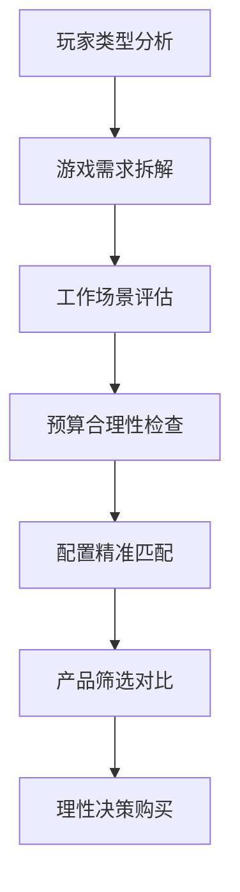
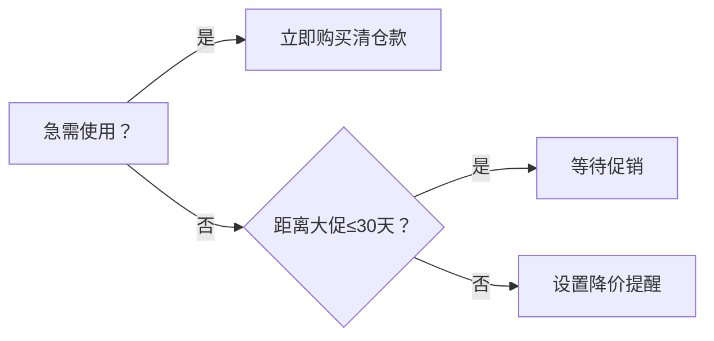

以下是根据最新版《游戏笔记本电脑选购指南》制定的**科学选购流程**，包含7个关键步骤，结合玩家类型分析和理性消费原则，助您精准选择最适合的设备：

---

### 🎮 **游戏本选购全流程（7步法）**


---

### 步骤1：玩家类型自测（决策基石）
> **目的**：避免配置浪费，聚焦真实需求
```markdown
1. **动机分析**（单选/多选）：
   - [ ] 竞争驱动（追求排名/帧率）
   - [ ] 成就驱动（全成就收集）
   - [ ] 探索驱动（开放世界爱好者）
   - [ ] 社交驱动（开黑语音需求）
   - [ ] 技术驱动（光追/AI尝鲜）

2. **投入程度**：
   - 日均游戏时长：___小时
   - 经验等级：[ ]新手 [ ]进阶 [ ]硬核
   - 投入意愿：[ ]性价比 [ ]平衡 [ ]顶配
```

---

### 步骤2：游戏需求拆解（量化指标）
> **方法**：找出需求最高的1-2款游戏 （按照官方推荐配置）
```markdown
| 游戏名称       | 画质要求 | 目标帧率 | 分辨率   | 特殊需求         |
|---------------|----------|----------|----------|------------------|
| 《CS2》       | 高       | 144fps+  | 1080p    | 240Hz屏幕        |
| 《艾尔登法环》 | 中       | 60fps    | 1440p    | 手柄兼容优化     |
| 《原神》      | 极高     | 60fps    | 4K       | 触控屏支持       |
```

---

### 步骤3：工作/学习场景评估
> **重点**：区分游戏与生产力需求
```markdown
- [ ] 视频剪辑：_________软件（Pr/Ae等）
- [ ] 3D建模：__________软件（Blender/Maya）
- [ ] 编程开发：_________语言（Python/C++）
- [ ] 移动办公：每日携带频率 ______次/周
- [ ] 续航要求：非游戏状态 ≥ ___小时
```

---

### 步骤4：预算合理性检查（防坑关键）
> **公式**：理性预算 = （主机价 × 0.7）+ 配件基金
```markdown
| 项目                | 建议占比 | 注意事项                  |
|---------------------|----------|-------------------------|
| 主机                | 70-85%   | 拒绝性能溢出（见附表）    |
| 配件（鼠标/耳机等） | 10-15%   | 外设直接影响体验          |
| 延保/维护           | 5-10%    | 建议购买2年以上全保       |
```

#### ⚠️ 性能溢出预警表（2025年数据）
| 玩家类型       | 显卡警戒线 | 内存警戒线 | 典型误区                 |
|----------------|------------|------------|--------------------------|
| 竞争驱动       | RTX 4070   | 32GB       | 追求RTX 4090帧率溢出300% |
| 成就驱动       | RTX 4060   | 24GB       | 为低频游戏强上4K屏       |
| 社交驱动       | RTX 4050   | 16GB       | 高价购入创作本打游戏     |

---

### 步骤5：配置精准匹配（核心环节）
> **基于玩家类型的配置方案**
```markdown
1. **竞争驱动型**（例：CS2/永劫玩家）：
   - CPU：i7-13650HX/R7 8845HS
   - GPU：RTX 4060（DLSS 4.0）
   - 内存：16GB DDR5
   - 屏幕：1080p 240Hz+3ms响应
   - 网络：Killer Wi-Fi 6E

2. **成就驱动型**（例：3A剧情玩家）：
   - CPU：i5-13500H/R5 8645HS
   - GPU：RTX 4050（光追入门）
   - 内存：24GB DDR5
   - 屏幕：2.5K 165Hz 100% DCI-P3

3. **社交驱动型**（例：MMO开黑玩家）：
   - CPU：i7-13620H/R7 8840HS
   - GPU：RTX 4050
   - 内存：32GB（多开必备）
   - 特色：AI降噪麦克风+高清摄像头
```

---

### 步骤6：产品筛选对比（实战技巧）
> **2025年性价比机型对比**
| 型号               | 适合玩家类型   | 关键优势                  | 价格     | 推荐指数 |
|--------------------|----------------|-------------------------|----------|----------|
| **华硕天选5锐龙版** | 竞争/社交      | 165Hz屏+双降噪麦克风     | ¥7,999   | ⭐⭐⭐⭐☆   |
| **拯救者R7000P**   | 成就/探索      | 2.5K广色域屏+一键超频    | ¥8,499   | ⭐⭐⭐⭐     |
| **ROG魔霸新锐**    | 技术驱动       | 液金散热+奥创智控中心    | ¥9,999   | ⭐⭐⭐☆     |

#### 🔍 对比工具推荐：
1. **参数对比**：[NotebookCheck](https://www.notebookcheck.net/)
2. **价格监控**：[慢慢买](https://www.manmanbuy.com/)
3. **评测验证**：[极客湾](https://www.geekerwan.com/)

---

### 步骤7：理性决策购买（防坑指南）
> **终极检查清单**
```markdown
- [ ] 验证玩家类型匹配度（步骤1）
- [ ] 核对游戏帧率达标情况（步骤2）
- [ ] 确认工作软件兼容性（步骤3）
- [ ] 计算4年总成本 ≤ 预算（步骤4）
- [ ] 排除性能溢出配置（步骤5）
- [ ] 对比3款以上机型（步骤6）
- [ ] 查看电商618/双11历史价
```

#### ⏰ 购买时机决策树


---

### 💡 选购金句（牢记原则）
> **“比顶级配置更重要的是配置与玩家类型的精准匹配”**  
> **“省下30%的性能溢出预算，换取200%的外设体验升级”**  
> **“没有最好的游戏本，只有最懂你的游戏本”**

通过这7步流程，您将获得：  
✅ **精准匹配**玩家类型的配置  
✅ **严格规避**性能溢出陷阱  
✅ **最大化**每元投入的体验价值  
✅ **轻松应对**2025年游戏技术演进